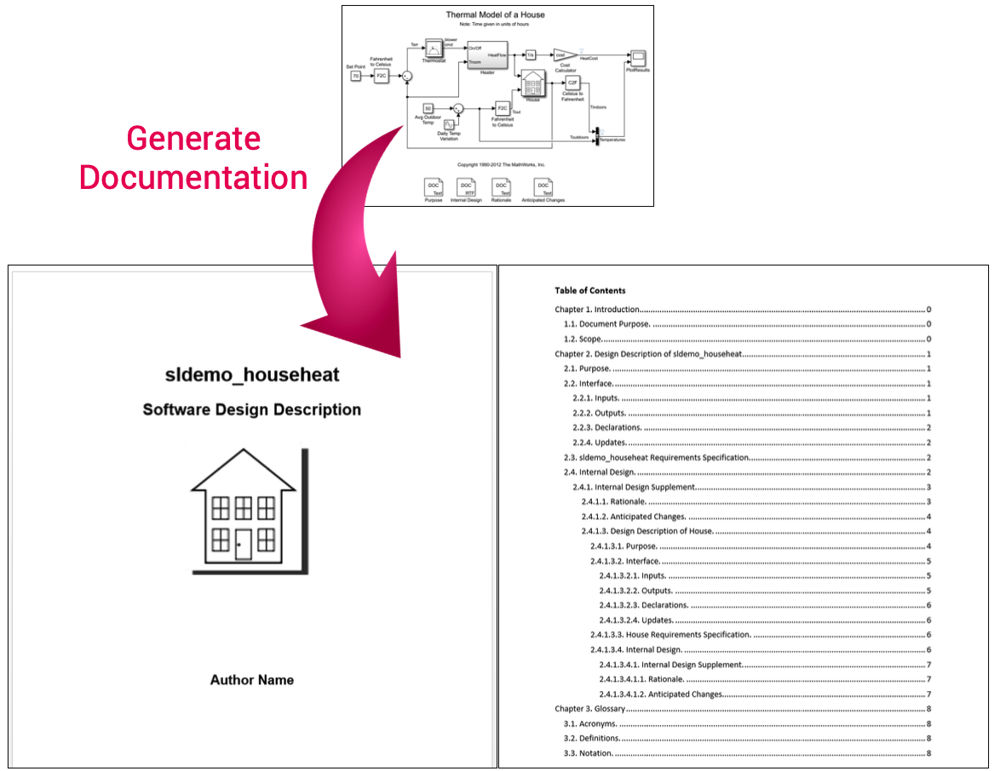

# Simulink Design Documenter

The Simulink Design Documenter provides tool support for semi-automated generation of Software Design Description documents for embedded systems developed using model-based design with Simulink. The Software Design Description is a document that describes the design of a Simulink system. Although appropriate software documentation has been viewed by many as an important factor in effective development of large industrial systems, in industrial practice software documentation has been typically neglected due to cost/time pressures. The purpose of the Simulink Design Documenter is to highly automate the production of useful Software Design Description documents for Simulink models, therefore significantly reducing the documentation effort.

## User Guide
For installation and other information, please see the [User Guide](doc/SimulinkDesignDocumenter_UserGuide.pdf).

For an in-depth guide, please see the [Full Guide](doc/SimulinkDesignDocumenter_FullGuide.pdf).

A short demo of the tool can be found at https://youtu.be/WBmHbhPmgRs.

## Related Publications
  
Alexander Schaap, Gordon Marks, Vera Pantelic, Mark Lawford, Gehan Selim, Alan Wassyng, and Lucian Patcas. 2018. ["Documenting Simulink Designs of Embedded Systems,"](https://dl.acm.org/doi/10.1145/3270112.3270115) *In Proceedings of the 21st ACM/IEEE International Conference on Model Driven Engineering Languages and Systems (MODELS): Companion Proceedings*, ACM, Copenhagen, Denmark, 47–51. DOI: https://doi.org/10.1145/3270112.3270115

  Vera Pantelic, Alexander Schaap, Alan Wassyng, Victor Bandur, and Mark Lawford. 2019. ["Something is Rotten in the State of Documenting Simulink Models,"](https://dl.acm.org/doi/abs/10.5220/0007586005030510) In *Proceedings of the 7th International Conference on Model-Driven Engineering and Software Development*, SciTePress, 503–510. DOI: https://doi.org/10.5220/0007586005030510

## Matlab File Exchange

This tool is also available on the [Matlab Central File Exchange](https://www.mathworks.com/matlabcentral/fileexchange/63252-simulink-design-documenter).

