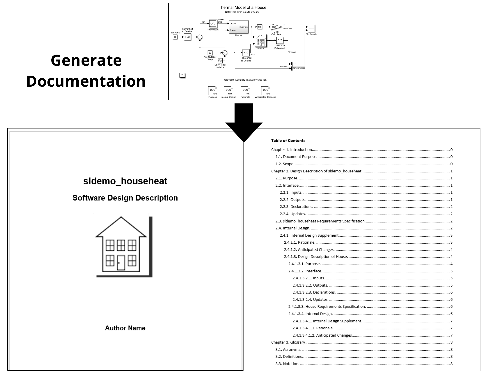

# Simulink Design Documenter

The Simulink Design Documenter provides tool support for semi-automated generation of Software Design Description documents for embedded systems developed using model-based design with Simulink. The Software Design Description is a document that describes the design of a Simulink system. Although appropriate software documentation has been viewed by many as an important factor in effective development of large industrial systems, in industrial practice software documentation has been typically neglected due to cost/time pressures. The purpose of the Simulink Design Documenter is to highly automate the production of useful Software Design Description documents for Simulink models, therefore significantly reducing the documentation effort.

## User Guide
For installation and other information, please see the [User Guide](doc/SimulinkDesignDocumenter_UserGuide.pdf).

## Full Guide
For an in-depth guide, please see the [Full Guide](doc/SimulinkDesignDocumenter_FullGuide.pdf).

## Demo
A short demo of the tool can be found at https://youtu.be/WBmHbhPmgRs.
